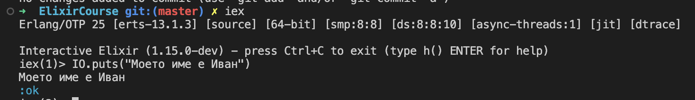

[](https://classroom.github.com/a/UjvRT554)
[](https://classroom.github.com/online_ide?assignment_repo_id=10267549&assignment_repo_type=AssignmentRepo)
# Задача 1

Точки: 15 (20 с бонус задачата)

## Предговор

Домашните в курса "Функционално прогирамиране с Elixir" ще се предават в Github.
В днешно време винаги, когато се работи с код, се използва [version control](https://en.wikipedia.org/wiki/Version_control) системa, доминиращата от които е [git](https://git-scm.com/). Ако не сте запознати с git, може да прочетете [нашето упътване](https://blog.elixir-lang.bg/materials/posts/how_to_git).

В Github хранилището автоматично ще бъде създаден `Feedback` Pull Request, в който ние можем да ви даваме насоки или Вие да питате въпроси. Ако в рамките на 1 ден не получите обратна връзка, може да се свържете с екипа на курса в Discord, тъй като има вероятност да пропуснем някой въпрос.

## Задачи

В Github хранилището трябва да добавите следните файлове:

- `answers.md`
- `task_if.exs`
- `task_calculator.ex`
- `screenshot.png` (разширанието на изображението няма значение, стига да се визуализира правилно в Github)

Файловете с код трябва да се намират в root директорията (не в папка `src`, `lib` и т.н.) на хранилището и да са **правилно именувани**.
Те ще бъдат оценени с автоматични тестове, които ще очакват **точно тези имена**.

## Въпроси и отговори (5 точки)

Тези въпроси са нужни, за да можем да преценим аудиторията на курса. От отговорите
може да зависят някои от финалните лекции на курса, в които ще разгледаме някои
библиотеки (за машинно самообучение, за GraphQL API, за работа с бази данни, за
конкурентна обработка на данни или др.)

Файлът `answers.md` трябва да съдържа следните въпроси, придружени с отговор в свободен текст.

### Въпроси

- Коя специалност и кой курс сте? (ако не учите във ФМИ напишете 'не съм студент')
- Защо записахте курса?
- Колко уверени се чувствате в използването на **_git_**? (число в интервала [0;10])
- Използвали ли сте друг функционален език и ако да, кой е той?
- Какви са Вашите интереси в областта на програмирането? (web, ML, etc.)
- Прикачете скрийншот на който се вижда Вашият терминал, в който изпълнявата
  последвателно `iex` и след това `IO.puts("Моето име е <Вашето име>")`. С това
  ще покажете, че успешно сте инсталирали Elixir.

Примерен отговор:

> #### Коя специалност и кой курс сте?
>
>     Компютърни науки, пети курс.
>
> #### Защо записахте курса?
>
>      Една от основните причини да посещавам курса е, че участвам
>      в организацията му. По-значимата причина е защото смятам, че
>      Elixir е един от най-интерсените езици, с които съм се
>      сблъсквал. Това, че е функционален, конкурентният му модел
>      и нестандартните конструкции в езика, засилват интереса ми
>      към Elixir още повече.
>
> #### Колко увере се чувствате в използването на **_git_**?
>
>     6.5/10
>
> #### Използвали ли сте друг функционален език и ако да, кой е той?
>
>      Да, използвал съм Haskell и Scheme, които изучавах в курса Функционално
>      програмиране във ФМИ. По-запознат съм с Haskell, тъй като написах
>      проекта си за курса на него. Чувствам се средно уверен в работата с
>      immutable данни и рекурсия без използването на mutable данни и цикли.
>
> #### Какви са Вашите интереси в областта на програмирането?
>
>     Интересно ми е да видя как и защо Elixir е подходящ за
>     разработката на web сървъри и дълго живеещи background jobs.
>     Чувал съм, че подходът за работа с бази данни е различен от
>     този в ActiveRecord в Ruby и използва Repository pattern.
>     Имам любителски интереси в областта на машинно самообучение.
>
> #### Прикачете скрийншот, на който се вижда Вашият терминал...
>
> 

## Задача 1 (5 точки)

Вашата задача е във файлa `task_if.exs` да напишете 2 анонимни функции (без дефиниция на модул).
Двете анонимни функции са свързани с имена `if_else` и `if_else_lazy`.

Пример за анонимна функция свързана с име, която добавя 10 към аргумента и го връща (ако е число):

```elixir
print_return = fn 
  arg when is_number(arg) -> arg + 10
  _ -> {:error, "Argument not a number"}
end
```

- `if_else` - функция, която приема 3 аргумента. Първият аргумент е произволна стойност ако
  тя се интерпретира като истина, то резултатът от функцията трябва да е вторият
  ѝ аргумент. Aко обаче първият аргумент се интерпретира като лъжа (проверете кои
  две стойности се интерпретират като лъжа в Elixir), то резултатът трябва да е третият
  аргумент на функцията.
  
  Пример:

  ```elixir
  iex> if_else.(true, "yes", "no")
  "yes"
  iex> if_else.(false, "yes", "no")
  "no"
  ```

- `if_else_lazy` - подобно на предната функция приема 3 аргумента с разликата,
  че вторият и третият аргумент са функции на 0 аргумента, като съответната
  функция трябва да бъде изпълнена само ако нейният резултат трябва да бъде
  върнат. `lazy` означава, че функцията ще бъде оценена само тогава, когато
  има нужда от нейния резултат.
  
  Пример:

  ```elixir
  iex> truth = fn() ->
  ...>   IO.puts "You are right."
  ...>   "yes"
  ...> end
  #Function<20.52032458/0 in :erl_eval.expr/5>
  iex> lie = fn() ->
  ...>   IO.puts "You are lying to me!"
  ...>   "no"
  ...> end
  #Function<20.52032458/0 in :erl_eval.expr/5>
  iex> if_else_lazy.(true, truth, lie)
  You are right.
  "yes"
  iex> if_else_lazy.(false, truth, lie)
  You are lying to me!
  "no"
  ```

## Задача 2 (5 точки + 5 бонус точки)

Във файла `task_calculator.ex` трябва имплементирате модул `Calculator`, който имплементира
няколко функции за **цели** числа:

- `Calculator.add(left, right)` - събира числата `left` и `right` и принтира на стандартния изход `<left> + <right> = <result>`
- `Calculator.sub(left, right)` - изважда числата `left` (умаляемо) и `right` (умалител) и принтира на стандартния изход `<left> - <right> = <result>`
- `Calculator.mult(left, right)` - умножава числата `left` и `right` и принтира на стандартния изход `<left> * <right> = <result>`
- `Calculator.div(left, right)` - разделя числата `left` (делимо) и `right` (делител) и принтира на стандартния изход `<left> / <right> = <result>`. Извършва целочислено деление (`7 / 2 = 3`, `10 / 7 = 1`)
- `Calculator.custom(left, right, function)` - връща резултата от прилагането на анонимната функция на два аргумента `function` към числата `left` и `right`. Не принтира нищо на стандартния изход.

### Бонус задача за допълнителни 5 точки:

> Точките, нужни за оформяне на оценка, ще бъдат скалирани спрямо основния брой точки
> от всяко домашно. Бонус точките са полезни, ако нямате възможност да напишете някое домашно или
> направите грешка в него, но не са нужни, за да завършите курса с оценка Отличен 6. Все пак Ви
> препоръчваме да опитате да решите и тази задача, за да се упражните в използването на Elixir.

- `Calculator.eval_rpn(binary_expr)` - Имплементира прочитане на израз в [обратен полски запис](https://en.wikipedia.org/wiki/Reverse_Polish_notation) и оценяването му.
  - Пример 1: `Calculator.eval_rpn("1 2 +") == 3` -> `1 + 2`
  - Пример 1: `Calculator.eval_rpn("1 2 3 + -") == -4` -> `1 - (2 + 3)`
  - Пример 1: `Calculator.eval_rpn("1 2 + 3 -") == 0` -> `1 + 2) - 3`
  - Пример 4: `Calculator.eval_rpn("1 2 + 3 / 5 * 6 *") == 30` -> `(1 + 2) / 3) * 5 * 6`
  - Пример 5: `Calculator.eval_rpn("1 2 + 3 / 5 * 6 * 7 - 8 /") == 2` -> `(((1 + 2) / 3) * 5 * 6 - 7) / 8`
  - Пример 6: `Calculator.eval_rpn("1 +") == {:error, :operator_error}` -> `+ работи се нуждае от 2 аргумента`
  - Пример 7: `Calculator.eval_rpn("1") == 1` -> `1`
  - Пример 7: `Calculator.eval_rpn("1 0 /") == {:error, :division_by_zero}` -> `1`

Насоки за имплементация:

- Разгледайте функцията `String.split/{2,3}`
- Разгледайте функцията `Integer.parse/1`
- Разгледайте функцията `Enum.reduce/3`

> `/<N>` в края на името на функцията обозначава броя аргументи на тази функция. Например `String.split/2` има 2 аргумента, а `String.split/3` има 3 аргумента.
